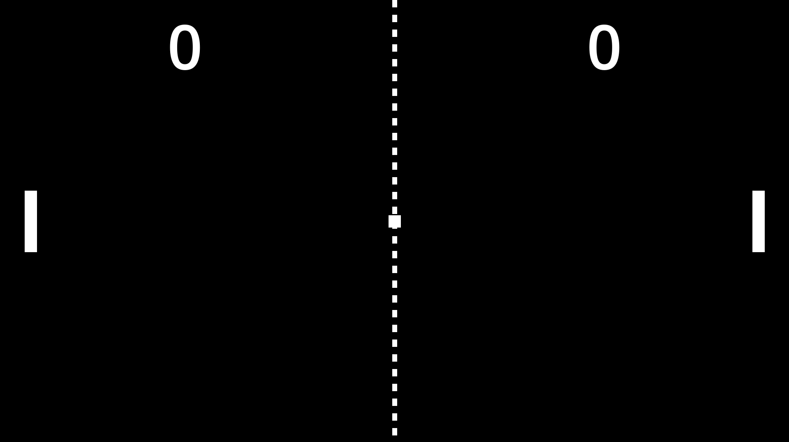

 

# Ping Pong | Project Touchstone #
[How to make PONG in Godot 4 for beginners](https://www.youtube.com/watch?v=GRgYRvv2mPY) by [Kaan Alpar](https://www.youtube.com/@KaanAlpar) ([GitHub](https://github.com/KaanAlpar))

This video tutorial provides a beginner-friendly introduction to developing a modern 2D Pong game in the Godot Engine, guiding viewers through the core systems required to create responsive controls and an engaging gameplay experience. It demonstrates essential game development concepts, including node-based scene organization, collision configuration, input mapping, paddle movement, ball physics, scoring mechanics, UI implementation, and game reset logic. The tutorial also explores gameplay features such as dynamic ball movement and paddle interactions, score tracking, computer-controlled opponent behavior, pause and restart systems, and sound effect integration to enhance player feedback during collisions and scoring events. Future updates and enhancements may include gameplay modifiers, progressive-round mechanics, and broader customization features to expand the overall experience while preserving the classic simplicity and accessibility that define the original Pong game. This tutorial and implementation process also served as the foundation for completing a structured development task on Feather, with the project integrated into the broader workflow supporting the Handshake AI Project Touchstone initiative.

# Assets #
[Ping Pong Assets](https://github.com/KaanAlpar/godot-pong-tutorial/tree/main/assets) by [Kaan Alpar](https://www.udemy.com/user/kaan-alpar-22/?srsltid=AfmBOopc6_i27wdigRNqzacgR7e7PI6f2ek_Msq-WUUtZor3aF4czmn9) ([GameDev.tv](https://gamedev.tv/courses/godot-2d?ref=mzfizgj))

# Create a Godot task #
<ins> What application is this task for? </ins>
 
Godot

### **Task prompt** ###
First, enter the **task prompt** and any relevant reference files (e.g., docs, diagrams, sketches, photos, schematics).

Tasks should sound like what a manager might give a skilled but junior employee: high-level guidance with some leeway on executional details, but with very clear success metrics. What a good outcome looks like must be very clear and easy to understand.

Please include any relevant **reference files** (e.g., docs, diagrams, sketches, photos, schematics) needed to complete this task.

Reminder on the difference between reference and starting state files:
- **Reference files**: anything the Employee should look at or read while completing the project that does not need to be directly loaded into the application (*'please make something that looks like XYZ image'*)
- **Starting state files (upload below)**: anything that the Employee would need to load into their workspace to complete the task (*'here is the existing file you should adapt'*)

<ins> Task prompt (ask the Employee) </ins>
 
We are beginning development of a modern 2D Ping Pong arcade game that emphasizes precise timing, spatial awareness, and competitive reflexes to create a clear and engaging gameplay experience. Your task is to design and implement a complete system for two players and a bouncing ball, using two short, white, rectangular, vertical paddles and a small white square ball. The paddles, ball physics, scoring zones, UI elements, and game states should get organized so that gameplay interactions, scoring, and state changes behave consistently throughout play. This system should establish the foundations for player movement, collision behavior, score tracking, gameplay interactions, and overall match progression. The game system must prioritize responsiveness, clarity, and consistency by incorporating well-structured keyboard input handling, accurate collision detection, and a stable locked camera system that maintains a clear view of the entire playfield at all times. All visual assets, including paddles, ball, UI elements, and level boundaries, must render sharply and clearly without distortion, preserving strong visual clarity throughout gameplay. A white dashed line should divide the center of the playfield, and pressing the E key should toggle a solid predictive trajectory line that visualizes the ball's path after a paddle hit. The game environment and all menu screens must use a completely black background to ensure high contrast with gameplay elements. The completed game system must support the following behaviors:

- The paddles move up and down with the W and S keys and the arrow keys, and stop when released.
- The ball always starts at the center and gradually increases speed after each paddle bounce.
- The ball plays one of two random beep sounds when it bounces from the walls and paddles.
- The score increases by one point when the ball enters either goal zone, triggering a win sound effect.
- The main menu is titled "PING PONG" at the center top with three vertically stacked mode buttons.
- The game supports three separate modes: "Player 1 vs COM," "Player 1 vs Player 2," and "COM vs COM."
- Pressing the Q key enables debug mode, allowing ball control with the UHJK keys while hiding the trajectory line.
- Pressing the Q key again while in debug mode exits the debug mode and resumes normal ball movement.
- Pressing the R key fully resets the game, restoring all states, positions, and UI elements to their initial values.
- Pressing the P key pauses the game with a centered "PAUSED" label, and pressing it again resumes the game.
- Pressing the Escape key returns to the main menu or closes the game when pressing it from the main menu.
- The game includes a 10-point win condition that only triggers when either player first exceeds 10 points.
- When a player exceeds 10 points, the current round ends and a new round begins, with both scores reset to 0.

Collision and scoring systems must reliably detect interactions between the ball, paddles, walls, and goal zones, ensuring correct score updates and consistent ball resets after each point. Sound feedback should be event-driven, with collision and scoring events triggering appropriate audio cues without delay. Computer opponent behavior must follow a predictable tracking system that maintains fairness while still providing a consistent challenge across different matchups. Game state management must support complete resets that restore gameplay flow, including score state, ball positioning, and match progression logic. UI systems must dynamically transition between menu and gameplay states, ensuring clear separation between the title screen, mode selection interface, and active match display. All additional systems, such as pause control, debug functionality, trajectory visualization, and menu navigation, must integrate cleanly into a unified state structure without disrupting core gameplay mechanics. This structure must remain modular and extensible, supporting future expansion of game modes, enhanced opponent logic, and additional rule variations while preserving consistent physics, input responsiveness, and state behavior across all gameplay scenarios.

<ins> Which of the following best fits this task? </ins>
 
Task from scratch

<ins> How long would you anticipate an 'Employee' to complete this task? (in hours) </ins>
 
4

### **Starting state** ###
Please describe and include below any information about the starting state of this project:
- Existing work to be modified
- Other assets or other inputs the Employee needs to bring to be able to complete this task

Reminder on the difference between the starting state and the reference files:
- **Starting state files**: anything that the Employee would need to load into their workspace to complete the task ('*here is the existing file you should adapt*')
- **Reference files (upload above)**: anything the Employee should look at or read while completing the project that does not need to be directly loaded into the application ('*please make something that looks like XYZ image*')

<ins> Starting state description </ins>
 
The starting state file will begin with a newly created 2D project with no gameplay systems, scenes, scripts, or visual assets other than the default setup. The only external resources included are a small set of audio files intended solely to support in-game feedback and enhance the overall gameplay experience. These audio assets are sound effects for ball collisions with paddles and walls, and a distinct sound effect for when the ball reaches a goal area to score a point. The Employee is responsible for designing and implementing a complete Ping Pong-style game from the ground up, using only the provided audio assets for sound feedback, and constructing all required scenes, nodes, scripts, collision systems, player and computer paddle behavior, ball physics, scoring logic, UI elements, and game flow management, such as round resets and win conditions. All visual elements, including paddles, ball, background, UI text, and lines, must be designed creatively using basic shapes within the engine, without relying on any external visual asset files.

### **Overall context** ###
Finally, include context on this task and why it is realistic and representative of real-life work:
- Why is this a reasonable task for a manager to ask a junior-level employee to do?
- Is there a larger project it might be a part of?

<ins> Task context </ins>
 
This task is a realistic and appropriate assignment for a junior-level developer, as it focuses on implementing the core mechanics of a classic 2D Ping Pong-style game. It involves building fundamental systems, including ball physics, paddle movement for both player and computer control, collision detection, scoring conditions, and round reset logic. The work requires applying essential programming and problem-solving skills to translate design requirements into interactive gameplay, while integrating audio feedback, input handling, and game state management into a cohesive experience using only provided sound assets. This type of task reflects common real-world development practices, where developers are responsible for constructing gameplay systems from minimal starting resources, organizing scenes and logic, and implementing reusable, maintainable code in a structured way. It could serve as part of a larger project focused on developing a complete arcade-style game framework and improving it with consistent computer behavior, additional game modes, enhanced UI elements, and expanded interface systems. By building these core systems, the task creates a flexible foundation for future improvements and new features, leading to a more modern, creative, and enjoyable Ping Pong game.

<ins> Rubric Items </ins>
 
1. The paddles, ball, dashed center line, score numbers, and PAUSED label render without visible distortion, blurring, or scaling artifacts.
- Run the main scene and confirm that the paddles, ball, dashed line, score, and pause label render at original quality without distortion.
- Pixel-perfect rendering preserves the retro visual style and helps ensure no distortion or scaling artifacts occur during gameplay.

2. The player characters are short, white, rectangular, vertical paddles.
- Run the main scene and observe that the player characters appear as short, white, rectangular, vertical paddles.
- The task prompt requires that the player characters appear as short, white, rectangular, vertical paddles.

3. The game environment and menu background are completely black.
- Run the main scene and observe that the game environment and menu background are completely black during gameplay.
- The task prompt requires that the game environment and menu background be completely black during gameplay.

4. The paddles stop at the top and bottom boundaries, and the ball collides with the paddles and the same level boundaries.
- Run the main scene and move the player characters up and down to confirm there is a collision with the ball and the level's border walls.
- Without body collision, the paddles would slide off-screen, and the ball would pass through objects, breaking core game interactions.

5. The camera displays the player paddles accurately during gameplay.
- Run the main scene and move the player paddles up and down to confirm that the camera accurately displays the entire game.
- The locked camera ensures a shared, equal view of the playfield, maintaining the symmetric design and preventing perspective shifts.

6. The paddles can move up and down and stop when input is released.
- Run the main scene, move the paddles up and down with the W and S keys and arrow keys, then release the keys to confirm they stop.
- Responsive input ensures paddles stop immediately upon release, preventing drift and allowing precise positioning to return the ball.

7. The bouncing ball can randomly play two different beep sound effects.
- Run the main scene, allowing the ball to hit the walls and paddles, and observe that two different beep sound effects play randomly.
- The random beeps provide immediate audio feedback when the ball hits a surface, reinforcing player timing and interaction cues.

8. The game restarts from the beginning when the user presses the R key.
- Run the main scene, press the R key during gameplay to confirm the game, ball, paddles, score, and visual elements reset completely.
- Without a fast reset, players must close and relaunch the game between matches, disrupting the rapid arcade gameplay loop.

9. The ball is a small, white, square object that always starts in the center and gradually increases speed after each paddle bounce.
- Run the main scene and observe a small white square ball starting at the center, and gradually increasing speed after each paddle hit.
- The task prompt requires the ball to reset to the center each round and gradually increase speed to create escalating difficulty.

10. The game has a score system that tracks both players, increments the score by one on each goal, and plays a win sound effect for the point.
- Run the main scene and observe that when the ball enters a goal area, the player's score label increases and a win sound plays.
- The task prompt requires reliable score tracking and audio feedback so players receive clear confirmation when scoring a point.

11. The main menu displays the title "PING PONG" in a large font at the top center with three vertically stacked mode selection buttons.
- Run the main scene and observe a main menu with the title "PING PONG" centered at the top and three stacked buttons in the middle.
- The main menu provides players a clear starting point, as without visible mode buttons and a title, they may not know how to begin.

12. The game includes three selectable game modes to experience: "Player 1 vs. COM," "Player 1 vs. Player 2," and "COM vs. COM."
- Run the main scene and switch between modes to confirm that the gameplay changes for single-player, multiplayer, and COM vs COM.
- The three modes cover the full range of single-player practice, head-to-head competitive play, and AI behavior demonstration.

13. The computer opponent is programmed with adjustable behavior, low reaction time, inconsistent ball tracking, and makes small mistakes.
- Run the main scene and play against the computer to confirm it follows predictable movement patterns and can be defeated.
- Inconsistent tracking with reaction limits makes single-player matches feel balanced and engaging rather than scripted and weak.

14. A white dashed line divides the game area, and pressing the E key displays a solid predictive line showing the bounce path of the ball.
- Run the main scene to observe the dashed center line, then press E to show a solid line that predicts the ball's path after a paddle hit.
- The dashed center line reinforces a playfield symmetry, while the trajectory toggle helps players understand the ball bounce path.

15. Pressing Q toggles debug mode for ball control with the UHJK keys, which hides the trajectory line, and pressing it again exits the mode.
- Run the main scene, press Q to activate debug mode, use UHJK keys to control the ball, and verify the line disappears until reset.
- Debug mode allows controlled testing of ball behavior, and hiding the trajectory line prevents it from interfering with manual control.

16. Pressing the P key displays a "PAUSED" label in the center, and pressing the same input again hides the label to resume the gameplay.
- Run the main scene, press the P key to show a "PAUSED" label, then press the P key again to hide the label and resume gameplay.
- Pausing lets players step away without losing progress, since interruptions would otherwise force them to abandon the match.

17. Pressing the Escape key during gameplay returns to the main menu, and pressing the Escape key again in the main menu closes the game.
- Run the main scene and press Escape during gameplay to return to the menu, then press Escape again to close the application.
- Escape provides a consistent way to leave any game mode, while the two-step behavior prevents accidental exits of the application.

18. When the ball crosses the left or right edge, the corresponding player scores a point, and the ball resets to the center to continue the match.
- Run the main scene and observe that when the ball enters either goal, the correct player scores, and the ball resets to the center.
- The task prompt requires reliable goal zone detection on both sides and a ball center reset after each point to continue the match.

19. The game has a 10-point win condition that ends the round when a player exceeds 10 points and starts a new round with a complete reset.
- Run the main scene and play until a player's score exceeds 10 to observe that the match ends, and a new round begins with a reset.
- The task prompt requires a defined win condition so the match has an end state, allowing the game to restart and support replayability.
 
Godot - Full Vertical Slice (Game Prototype) - Finished prompt creation.
